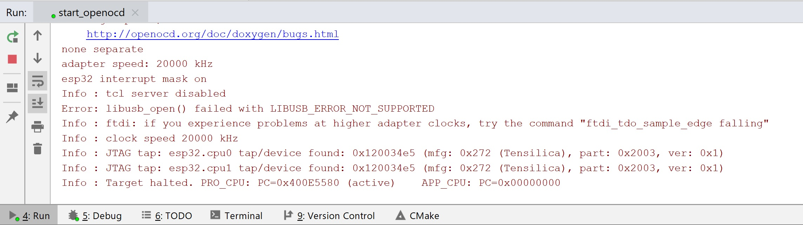

# mongoose-os-template
Mongoose os template with the following features:
- CMake with:
    * local quick compilation (run mos build first - to generate files, for examples configs)
        * ESP8266 and ESP32 - xtensa 
        * Windows - VS C++
    * full mos build
- ESP32 on-chip debugging (GDB) with OpenOCD and JTAG
    1) build and flash MCU.
    2) Connect JTAG to MCU. I use ESP32 devkit + FTDI FT2232H. Pinout (https://www.ftdichip.com/Support/Documents/DataSheets/ICs/DS_FT2232H.pdf):
    
    | ESP32         | JTAG          |
    | ------------- | ------------- |
    | GPIO 12 (TDI) | ADBUS1        |
    | GPIO 13 (TCK) | ADBUS0        |
    | GPIO 14 (TMS) | ADBUS3        |
    | GPIO 15 (TDO) | ADBUS2        |
    | GND           | GND           |
    
    Optinally you can use VCC from JTAG and connect reset pin. 
    
    3) run start_openocd.bat. I usually do it by hand. You can reconfigure appropriate OpenOCD configuration inside the file.
    
    4) update .gdbinit and\or .gdbinit-command-line accordingly
    5) start debugger:
        * command line:
            1) start xtensa-esp32-elf-gdb.exe -x tools/.gdbinit-command-line build/objs/mongoose-os-template.elf
            
        * clion:
            1) Create GDB remote debug configuration. You can use OpenOCD Download & Run however you cannot configure it with additional params (as for now)
            
            2) Create custom tool (debug_copy_gdbinit.cmd) and run it before lunch - CLion does not allow to use local .gdbinit as for now so we copy it to %HOME%/.gdbinit before each run.
            3) Select config and press Debug (Alt + F5).
               
- Google test under windows build
- CLion tested
- other build, flash scripts
    * Look into tools folder

Some features are still in development
